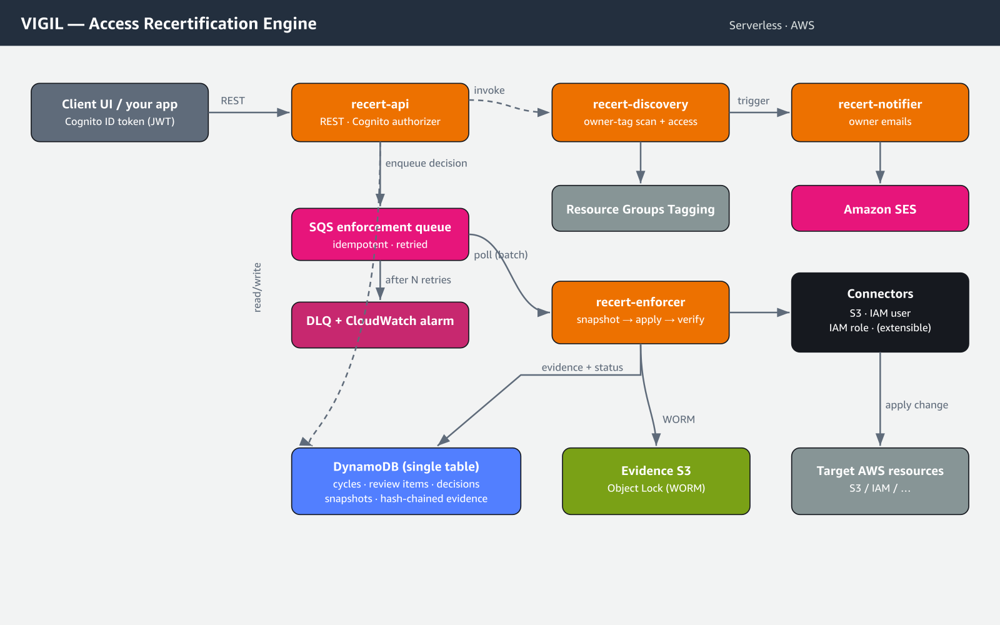

# VIGIL — Access Recertification Engine

VIGIL is a standalone, production-grade **access recertification engine** for AWS. It
discovers resources by their `owner` tag, raises review requests to the owners, accepts
owner decisions (**certify / modify / revoke**), and then **durably enforces the resulting
permission change** on the resource — with an immutable, hash-chained evidence trail for
every decision and every change applied.

The engine is integration-first: a documented REST API drives all behavior, so it can be
embedded behind your own UI. This repository also ships a minimal, AWS Console–styled
React UI for owners and admins.

> Looking for implementation details, the API reference, or how to extend the engine to
> new resource types? See the **[Developer Guide](engine/DEVELOPER_GUIDE.md)**.

---

## What it does

1. **Discover** — enumerate resources tagged `owner=<email>`, resolve who has access to
   each (bucket policy / IAM / ACL), and create per-owner review items for a cycle.
2. **Request / notify** — email each owner their pending reviews with a deep link.
3. **Decide** — owners certify, modify (remove specific permissions), or revoke, per
   resource or per principal.
4. **Enforce** — a durable, idempotent worker applies the change through a pluggable
   **resource connector**, snapshotting the before-state for rollback and recording
   hash-chained evidence.

Automated enforcement ships for **Amazon S3 buckets**, **IAM users**, and **IAM roles**.
Any other tagged resource type is fully recertifiable; unsupported types fall back to an
IT-admin ticket instead of an unsafe automated change. New types are added by implementing
one connector — see the Developer Guide.

---

## Repository layout

```
engine/                  # The recertification engine (the product)
  README.md              # Engine overview
  DEVELOPER_GUIDE.md     # Full developer documentation
  template.yaml          # Deployable SAM stack (engine only)
  openapi.yaml           # REST API contract for client UIs
  src/
    api/                 # REST API handler (cycles, reviews, decisions, snapshots, rollback)
    discovery/           # Owner-tag discovery + access enumeration
    enforcer/            # SQS consumer -> connectors (durable enforcement)
    notifier/            # SES owner notifications
    connectors/          # Pluggable resource connectors (S3, IAM user, IAM role) + registry
    core/                # Models, decision intake, enforcement orchestration, evidence, rollback
    lib/                 # config, ddb, hash chain, time, http helpers
  tests/                 # node:test unit tests
ui/                      # React 18 + Vite SPA (Login + Recertification + Discovery admin)
src/, scripts/, ...      # Legacy VIGIL platform components (audit, IdP sync, dashboards) — not
                         # part of the shipped engine; retained for reference (tag: pre-engine)
```

---

## Architecture



```
                       +-------------------+
  Client UI  --REST-->  |   recert-api      |  cycles / reviews / decisions / rollback
  (Cognito JWT)        +---------+---------+
                                 | enqueue (decision)
                                 v
                          +-------------+        +------------------+
                          |  SQS queue  |--DLQ-->|  alarm + replay  |
                          +------+------+        +------------------+
                                 |
                                 v
                       +-------------------+   snapshot -> apply -> verify -> evidence
                       |  recert-enforcer  |--> Resource Connectors (S3, IAM user, IAM role)
                       +---------+---------+
                                 |
              +------------------+------------------+
              v                  v                  v
        DynamoDB            Evidence (optional      SES (owner notifications)
   (cycles/items/           S3 WORM)
    decisions/snapshots)
```

Discovery and notification run as their own Lambda functions, triggered on cycle creation
and by an EventBridge schedule. The REST API is protected by an **Amazon Cognito user pool
authorizer** (`COGNITO_USER_POOLS`); callers pass a Cognito ID token in the `Authorization`
header.

---

## Prerequisites

- AWS CLI v2
- AWS SAM CLI v1.100+
- Node.js 20+ (the engine runs on the `nodejs24.x` Lambda runtime, which provides AWS SDK v3)

---

## Quick start

```bash
cd engine

# Build and deploy (creates its own Cognito pool if you don't supply one)
sam build
sam deploy --guided \
  --stack-name recert-engine-dev \
  --parameter-overrides Stage=dev SesSenderEmail=you@example.com \
                        UiBaseUrl=https://your-ui.example.com
```

The deploy outputs the API endpoint, DynamoDB table name, SQS queue URL, and (if created)
the Cognito user pool and client IDs.

Create an admin/owner user in the pool:

```bash
aws cognito-idp admin-create-user --user-pool-id <POOL_ID> \
  --username owner@example.com --user-attributes Name=email,Value=owner@example.com \
  --message-action SUPPRESS
aws cognito-idp admin-set-user-password --user-pool-id <POOL_ID> \
  --username owner@example.com --password '<StrongTempPassword>' --permanent
aws cognito-idp admin-add-user-to-group --user-pool-id <POOL_ID> \
  --username owner@example.com --group-name owner
```

Tag a resource so it is discovered, then start a cycle from the UI **Discovery** page or:

```bash
curl -X POST "$API/cycles" -H "Authorization: <ID_TOKEN>" \
  -H 'Content-Type: application/json' -d '{"cycleType":"AD_HOC"}'
```

Full deployment, API, and extension instructions are in the
**[Developer Guide](engine/DEVELOPER_GUIDE.md)**.

---

## The UI

`ui/` is a React 18 + Vite single-page app styled to match the AWS Management Console
(Cloudscape look, Amazon Ember typeface). It contains exactly two areas:

- **Recertification** — owners review and decide on their resources (per-resource and
  per-principal).
- **Discovery** (admin only) — start a fresh cycle and view run history with outcome counts
  (certified / revoked / modified / pending, completion %).

Configure `ui/.env` with the deployed `VITE_API_URL`, `VITE_COGNITO_USER_POOL_ID`, and
`VITE_COGNITO_CLIENT_ID`, then `npm run build` and host `dist/` (for example on S3 +
CloudFront).

---

## Configuration

| Variable | Required | Purpose |
|---|---|---|
| `TABLE_NAME` | yes | DynamoDB single-table store |
| `ENFORCEMENT_QUEUE_URL` | yes | SQS queue the API enqueues decisions to |
| `EVIDENCE_BUCKET` | no | S3 Object Lock (WORM) bucket for evidence mirroring |
| `SES_SENDER_EMAIL` | yes | Verified SES sender for owner emails |
| `UI_BASE_URL` | yes | Base URL used in email deep links |
| `RECERT_DEADLINE_DAYS` | no (14) | Review window |
| `MANAGEMENT_ACCOUNT_ID` | no | Resolved from STS at runtime if unset |
| `CROSS_ACCOUNT_ROLE_NAME` | no (`VIGILCrossAccountRole`) | Role assumed in member accounts |

---

## Testing

```bash
cd engine
node --test tests/connectors.test.mjs
```

Connector tests assert the production-correctness invariants: scoped revoke (no over-broad
detach), scoped modify, full revoke, IAM role/user partials, and idempotent enforcement.

---

## Security

- The REST API requires a valid Cognito token on every request (`COGNITO_USER_POOLS`
  authorizer). Owner identity is derived from the token, not the request body.
- Each Lambda uses a least-privilege role scoped to the actions it performs.
- Enforcement is **scoped**: a revoke/modify only affects the target resource. When access
  is granted via IAM and cannot be safely narrowed in place, the engine adds a scoped
  explicit `Deny` on the resource rather than mutating the principal's IAM policies.
- Every decision and change is recorded in an append-only, hash-chained evidence trail;
  enable `EVIDENCE_BUCKET` for WORM (Object Lock) retention.

---

## Cleanup

```bash
cd engine
sam delete --stack-name recert-engine-dev
```

The DynamoDB table and (if enabled) the evidence bucket use `DeletionPolicy: Retain`. If you
enabled the WORM evidence bucket, its objects cannot be deleted until their Object Lock
retention period expires.

---

## License

MIT-0. This project is provided as a sample for educational and demonstration purposes; it
is not intended for production use without additional security review and hardening.
